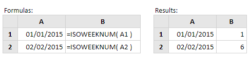

# ISOWEEKNUM

Fungsi Excel **Isoweeknum** mengembalikan nomor minggu ISO dari tanggal yang disediakan.

Sintaks fungsi Isoweeknum adalah:

```text
ISOWEEKNUM (date)
```

di mana argumen tanggal adalah tanggal Excel yang ingin Anda temukan angka minggu dari ISO.

Perhatikan bahwa Anda disarankan untuk tidak mengetik tanggal secara langsung ke dalam fungsi, karena Excel dapat menafsirkan representasi teks dari tanggal secara berbeda, tergantung pada pengaturan interpretasi tanggal pada komputer Anda. Oleh karena itu argumen tanggal untuk fungsi Isoweeknum harus dimasukkan sebagai:

1. Referensi ke sel yang berisi tanggal atau
2. Tanggal kembali dari formula.

**Contoh:**



