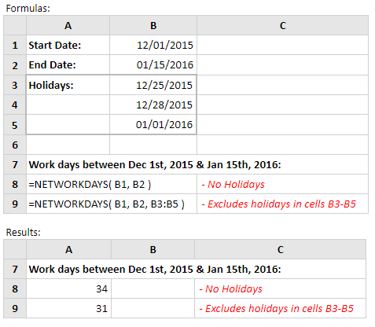

# NETWORKDAYS

Fungsi Excel Networkdays menghitung jumlah hari kerja antara dua tanggal yang disediakan \(termasuk tanggal mulai dan berakhir\). Perhitungan mencakup semua hari kerja \(Senin - Jumat\), tidak termasuk daftar hari libur yang disediakan.

Sintaks fungsi adalah:

```text
NETWORKDAYS (start_date, end_date, [holidays])
```

**Contoh:**



Array \[**holidays**\] telah dihilangkan dari perhitungan di sel A8. Karena itu hasil ini tidak termasuk hari Sabtu dan Minggu tetapi termasuk semua hari kerja lainnya, termasuk hari libur pada Natal dan Tahun Baru. Dalam contoh di sel A9, array \[holidays\] \(dalam sel B3 - B5\) disediakan untuk fungsi Networkdays. Oleh karena itu perhitungan tidak termasuk hari Sabtu dan Minggu dan hari libur Natal dan Tahun Baru yang terdaftar.

