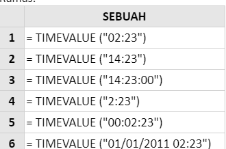
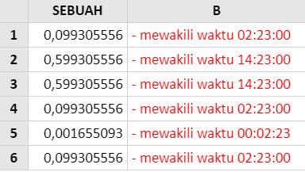

# TIMEVALUE

## Syntax



```text
TIMEVALUE ( time_text )
```



## Parameter

| Parameter | Deskripsi |
| :--- | :--- |
| time\_text | string teks yang mewakili waktu. Dalam string teks ini, jam, menit dan detik harus dipisahkan dengan titik dua. |


### Interpretasi String Teks Waktu

Jika hanya dua nilai \(dipisahkan oleh titik dua\) diberikan \(mis. 02:54\), ini akan diperlakukan sebagai jam dan menit, bukan menit dan detik. Jika Anda ingin mewakili 2 menit dan 54 detik, ini harus dilengkapi dengan jam yang ditentukan sebagai nol \(mis. "00:02:54"\).

Perhatikan juga bahwa, jika argumen time\_text berisi tanggal dan waktu, fungsi Timevalue mengabaikan bagian tanggal dari string teks.

Aturan-aturan ini diilustrasikan dalam contoh di bawah ini.


## Contoh Implementasi





