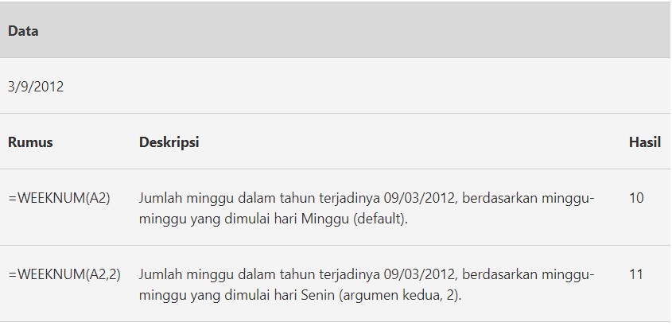

# WEEKNUM

#### Syntax

```text
WEEKNUM( serial_number, [return_type] )
```

| Parameter | Deskripsi |
| :--- | :--- |


| serial\_number | Tanggal Excel yang Anda inginkan untuk mengembalikan nomor minggu. |
| :--- | :--- |


<table>
  <thead>
    <tr>
      <th style="text-align:left">[return_type]</th>
      <th style="text-align:left">
        <p>Argumen opsional, yang menentukan sistem penomoran mana yang akan digunakan
          dan hari kerja mana yang harus diperlakukan sebagai awal minggu.</p>
        <p>Dua sistem penomoran yang berbeda adalah:</p>
        <p>Sistem 1- Minggu yang mengandung 1 Januari diberi nomor minggu 1;</p>
        <p>Sistem 2- Minggu yang berisi Kamis pertama tahun ini diberi nomor minggu
          1.</p>
      </th>
    </tr>
  </thead>
  <tbody></tbody>
</table>
Nilai yang mungkin dari \[return\_type\] adalah:

| \[return\_type\] | Berarti |
| :--- | :--- |
| 1 | Minggu berjalan dari Minggu hingga Sabtu; Menggunakan sistem penomoran 1 |
| 2 | Minggu berjalan dari Senin hingga Minggu; Menggunakan sistem penomoran 1 |
| 11 | Minggu berjalan dari Senin hingga Minggu; Menggunakan sistem penomoran 1 |
| 12 | Minggu berjalan dari Selasa hingga Senin; Menggunakan sistem penomoran 1 |
| 13 | Minggu berjalan dari Rabu hingga Selasa; Menggunakan sistem penomoran 1 |
| 14 | Minggu berjalan dari Kamis hingga Rabu; Menggunakan sistem penomoran 1 |
| 15 | Minggu berjalan dari Jumat hingga Kamis; Menggunakan sistem penomoran 1 |
| 16 | Minggu berjalan dari Sabtu hingga Jumat; Menggunakan sistem penomoran 1 |
| 17 | Minggu berjalan dari Minggu hingga Senin; Menggunakan sistem penomoran 1 |
| 21 | Minggu berjalan dari Senin hingga Minggu; Menggunakan sistem penomoran 2 |

Jika dihilangkan, argumen \[return\_type\] diatur ke nilai default 1 \(yaitu fungsi mengasumsikan bahwa seminggu dimulai pada hari Minggu dan sistem penomoran 1 digunakan\).

Perhatikan bahwa hanya opsi 1 dan 2 di atas yang tersedia di Excel 2007 dan sebelumnya.


## Contoh Implementasi



