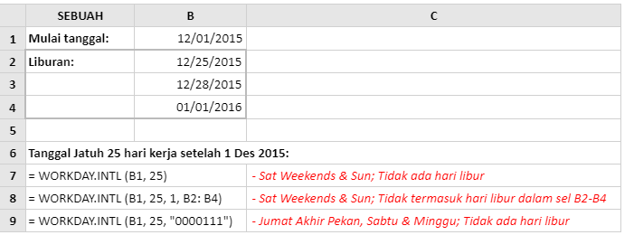
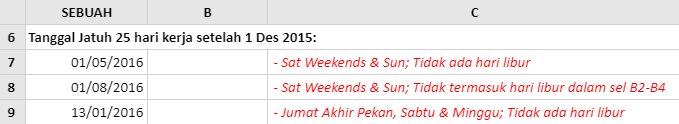

# WORKDAY.INTL

### Syntax



```text
WORKDAY.INTL( start_date, days, [weekend], [holidays] )
```



### Parameter

| Parameter | Deskripsi |
| :--- | :--- |
| start\_date | Tanggal awal, untuk menghitung jumlah hari kerja. |
| days | Jumlah hari kerja yang ditambahkan ke start\_date . |
| \[weekend\] | Menunjukkan hari dalam seminggu yang merupakan akhir pekan dan tidak dianggap hari kerja. Akhir pekan adalah jumlah akhir pekan atau string yang menentukan kapan akhir pekan terjadi. |
| \[holiday\] | Argumen opsional, yang menentukan array tanggal \(selain akhir pekan\) yang tidak dihitung sebagai hari kerja. |




| Nilai angka yang mungkin untuk argumen **\[weeken\]** adalah: |
| :--- |


| \[akhir pekan\] | hari dihitung  sebagai akhir pekan |
| :--- | :--- |
| 1  \(atau dihilangkan\) | Sabtu & Minggu |
| 2 | Sun & Mon |
| 3 | Sen & Sel |
| 4 | Sel & Rab |
| 5 | Rabu & Kamis |
| 6 | Kam & Jum |
| 7 | Jum & Sab |
| 11 | Hanya hari minggu |
| 12 | Hanya hari Senin |
| 13 | Hanya hari Selasa |
| 14 | Hanya hari Rabu |
| 15 | Hanya kamis |
| 16 | Hanya hari Jumat |
| 17 | Hanya hari sabtu |

Nilai string yang mungkin untuk argumen \[akhir pekan\]terdiri dari serangkaian tujuh 0 dan 1 yang mewakili tujuh hari kerja, mulai dari Senin.

Setiap 1 menunjukkan hari yang harus dihitung sebagai akhir pekan dan setiap 0 mewakili hari kerja.

Sebagai contoh,

| 0000100 | - | menunjukkan hari Jumat hanya dihitung sebagai hari akhir pekan |
| :--- | :--- | :--- |
| 0001100 | - | menunjukkan Kamis dan Jumat dihitung sebagai hari akhir pekan |
| 0000111 | - | menunjukkan hari Jumat, Sabtu dan Minggu dihitung sebagai hari akhir pekan |

String "1111111" tidak valid.


### Contoh Implementasi

Lembar kerja di bawah ini menunjukkan tiga contoh fungsi Excel Workday.Intl. Dalam ketiga contoh, fungsi tersebut digunakan untuk menghitung tanggal yaitu 25 hari kerja setelah 01 Desember 2015. Namun, akhir pekan dan hari libur berbeda dalam setiap kasus.





Perhatikan bahwa, dalam rumus di atas:

*  Dalam contoh di sel A7, akhir pekan memiliki pengaturan default \(jatuh pada hari Sabtu dan Minggu\), sehingga argumen \[akhir pekan\] dapat dihilangkan dari fungsi;
*  Dalam contoh di sel A7 dan A9, tidak ada hari libur tambahan yang akan dimasukkan dalam perhitungan, sehingga argumen \[hari libur\] dihilangkan dari fungsi;
*  Dalam contoh di sel A9, string teks "0000111" mendefinisikan akhir pekan menjadi hari Jumat, Sabtu dan Minggu.

