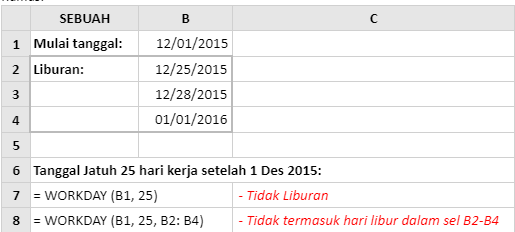
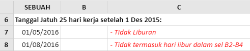

# WORKDAY

### Syntax



```text
WORKDAY( start_date, days, [holidays] )
```



### Parameter

| Parameter | Deskripsi |
| :--- | :--- |
| start\_date | Tanggal awal, untuk menghitung jumlah hari kerja. |
| days | Jumlah hari nonakhir pekan dan nonhari libur sebelum atau setelah start\_date. Nilai positif untuk hari mengembalikan tanggal mendatang, nilai negatif mengembalikan tanggal lampau. |
| \[holidays\] | Argumen opsional, yang menentukan array tanggal \(selain akhir pekan\) yang tidak dihitung sebagai hari kerja. |


 **Penting:** Tanggal harus dimasukkan dengan menggunakan fungsi DATE, atau sebagai hasil dari rumus atau fungsi lain. Contoh, gunakan DATE\(2008,5,23\) untuk tanggal 23 Mei 2008. Masalah bisa muncul jika tanggal dimasukkan sebagai teks.


### Contoh Implementasi

Dalam spreadsheet di bawah ini, fungsi Excel Workday digunakan untuk menemukan tanggal yang adalah 25 hari kerja setelah 01 Desember 2015. Contoh pertama \(dalam sel A7\) hanya mengecualikan akhir pekan dari perhitungan, sedangkan contoh kedua \(dalam sel A8\) tidak termasuk akhir pekan dan daftar liburan yang disediakan.





Perhatikan bahwa, dalam spreadsheet di atas:

* Dalam contoh di sel A7 array \[holidays\] telah dihilangkan. Oleh karena itu perhitungan tidak termasuk hari Sabtu dan Minggu tetapi mencakup semua hari kerja lainnya, termasuk hari libur pada Natal dan Tahun Baru.
* Dalam contoh di sel A8 array \[**holidays**\] \(dalam sel B2-B4\) disediakan untuk fungsi Workday. Oleh karena itu perhitungan tidak termasuk hari Sabtu dan Minggu dan hari libur Natal dan Tahun Baru yang ditentukan.  Perhatikan juga bahwa, seperti yang direkomendasikan oleh Microsoft, dalam panggilan ke fungsi Workday, argumen **start\_date** dan **\[holidays\]** telah disediakan sebagai referensi sel.


