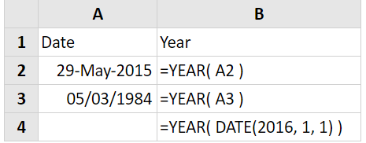
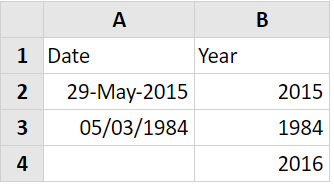

# YEAR

### Syntax



```text
YEAR( serial_number )
```



### Parameter

| Parameter | Deskripsi |
| :--- | :--- |
| serial\_number | anggal di mana Anda ingin mengembalikan tahun. |

### Contoh Implementasi

Kolom B dari spreadsheet berikut menunjukkan fungsi Tahun Excel, yang digunakan untuk mengekstrak tahun dari tiga tanggal yang berbeda.






