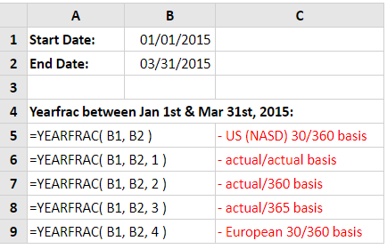
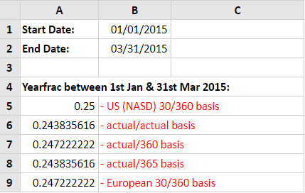

# YEARFRAC

#### Syntax

```text
YEARFRAC( start_date, end_date, [basis] )
```

| Parameter | Deskripsi |
| :--- | :--- |
| start\_date | Tanggal yang menunjukkan tanggal mulai. |
| end\_date | Tanggal yang menunjukkan tanggal akhir. |
| \[basis\] | Tipe basis perhitungan hari untuk digunakan. |


Nilai yang mungkin dari **\[basis\]**

\*\*\*\*

| **Basis** | **Basis perhitungan hari** |
| :--- | :--- |
| 0 atau dihilangkan | US \(NASD\) 30/360 |
| 1 | Aktual/Aktual |
| 2 | Aktual/360 |
| 3 | Aktual/365 |
| 4 | European 30/360 |


## Contoh Implementasi

Lembar kerja di bawah ini menunjukkan lima contoh fungsi Excel Yearfrac. Dalam setiap kasus, fungsi ini digunakan untuk menghitung fraksi tahun antara 1 Januari 2015 dan 31 Maret 2015. Namun, setiap kasus menggunakan Dasar Hitungan Hari yang berbeda.





