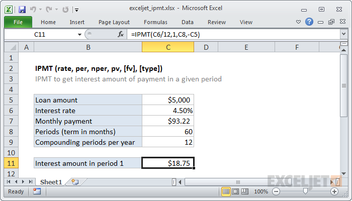

# Excel IPMT Function




#### Syntax

```text
=IPMT (rate, per, nper, pv, [fv], [type])
```

#### Parameter 

| **Parameter** | **Penjelasan** |
| :--- | :--- |
|  rate | presentase bunga \(setiap periode\) |
| per | pembayaran ke-n. |
| nper | total periode pembayaran |
| pv | nilai Awal pinjaman |
| \[fv\] | Uang yang harus dibayar di akhir periode |


* Konsisten dengan input untuk rate
* Berdasarkan konvensi, nilai pinjaman \(pv\) dimasukkan sebagai nilai negatif.


