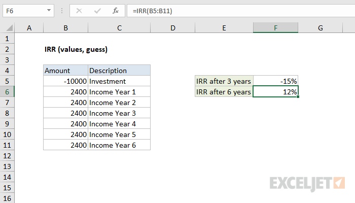

# Excel IRR Function




#### Syntax

```text
=IRR (values, [guess])
```

#### Parameter 

| **Parameter** | **Penjelasan** |
| :--- | :--- |
| values | referensi ke sel yang berisi nilai. |
| guess | \[opsional\] Perkiraan untuk IRR yang diharapkan. Standarnya adalah .1 \(10%\). |


* Jika IRR mengembalikan \#NUM! atau hasil yang tidak terduga, sesuaikan guess


