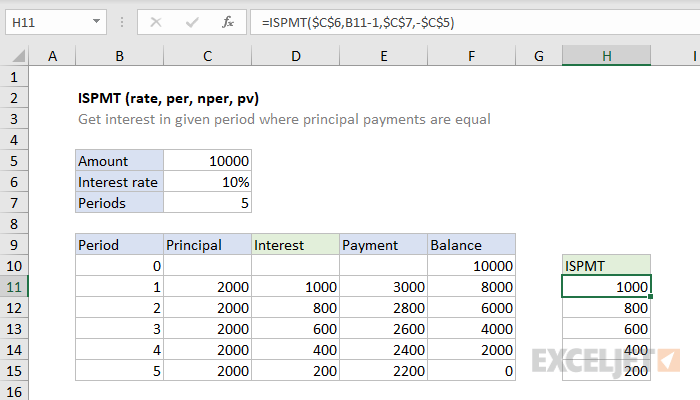

# Excel ISPMT Function




#### Syntax

```text
=ISPMT (rate, per, nper, pv)
```

#### Parameter 

| **Parameter** | **Penjelasan** |
| :--- | :--- |
|  rate | suku bunga |
| per | periode |
| nper | jumlah periode |
| pv | nilai awal |


* Fungsi ISPMT adalah untuk pinjaman dengan pembayaran pokok. Untuk pinjaman dengan pembayaran berkala, gunakan fungsi IPMT.


