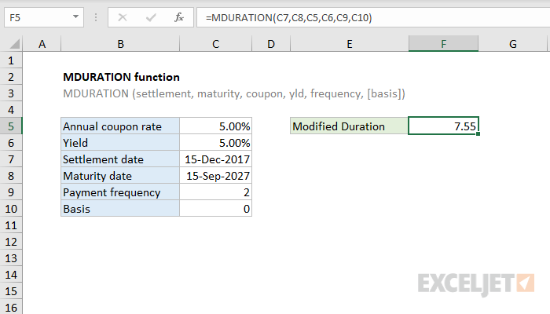

# Excel MDURATION Function




#### Syntax

```text
=MDURATION (settlement, maturity, coupon, yld, freq, [basis])
```

| **Penjelasan** |  |
| :--- | :--- |
|  settlement | Settlement tanggal keamanan |
| maturity | Maturity tanggal keamanan |
| coupon | Tingkat kupon tahunan keamanan |
| yld | Hasil tahunan keamanan |
| freq | Jumlah pembayaran kupon per tahun |
| basis | \[opsional\] Dasar hitungan hari |


* ika tanggal tidak valid \(mis. Bukan tanggal sebenarnya\) MDURATION mengembalikan \#VALUE!


