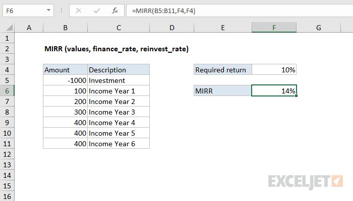

# Excel MIRR Function




#### Syntax

```text
=MIRR (values, finance_rate, reinvest_rate)Parameter 
```

| **Parameter** | **Penjelasan** |
| :--- | :--- |
|  values | referensi ke sel yang mengandung arus kas |
| finance\_rate | Tingkat pengembalian yang diperlukan \(tingkat diskont\) sebagai persentase. |
| reinvest\_rate | Suku bunga yang diterima pada arus kas diinvestasikan kembali sebagai persentase |


* Array nilai harus mengandung setidaknya satu nilai positif dan satu nilai negatif.


