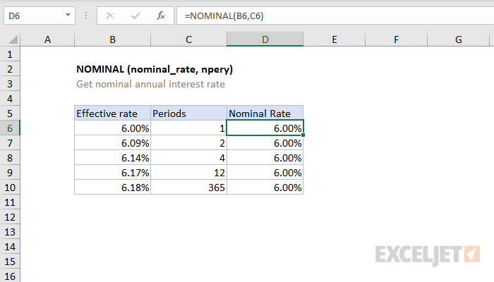

# Excel NOMINAL Function




#### Syntax

```text
=NOMINAL (effect_rate, npery)Parameter 
```

| **Parameter** | **Penjelasan** |
| :--- | :--- |
|  effect\_rate | Suku bunga tahunan efektif |
| npery | Jumlah periode campuran per tahun. |


* Angka efektif harus berupa angka antara 0 dan 1.
* Npery harus berupa bilangan bulat


