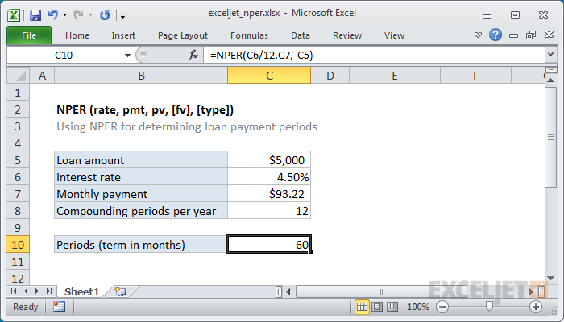

# Excel NPER Function




#### Syntax

```text
=NPER (rate, pmt, pv, [fv], [type])Parameter 
```

| **Parameter** | **Penjelasan** |
| :--- | :--- |
|  rate | Tingkat bunga per periode |
| pmt | Pembayaran dilakukan setiap periode |
| pv | Nilai sekarang |
| fv | \[opsional\] Nilai masa depan |
| type | \[opsional\] Saat pembayaran jatuh tempo. 0 = akhir periode. 1 = awal periode. Standarnya adalah 0 |


* Pastikan Anda memberikan harga yang konsisten dengan periode. Misalnya, jika suku bunga tahunan 12 persen, gunakan 12% / 12 untuk suku bunga agar NPER kembali periode dalam beberapa bulan.


