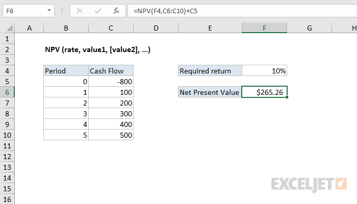

# Excel NPV Function




#### Syntax

```text
=NPV (rate, value1, [value2], ...)Parameter 
```

| **Parameter** | **Penjelasan** |
| :--- | :--- |
|  rate | Tingkat diskon selama satu periode |
| value1 | Nilai pertama mewakili arus kas |
| value2 | \[opsional\] Nilai kedua yang mewakili arus kas |


* Nilai harus diberi jarak yang sama dalam waktu dan terjadi pada akhir setiap periode.



