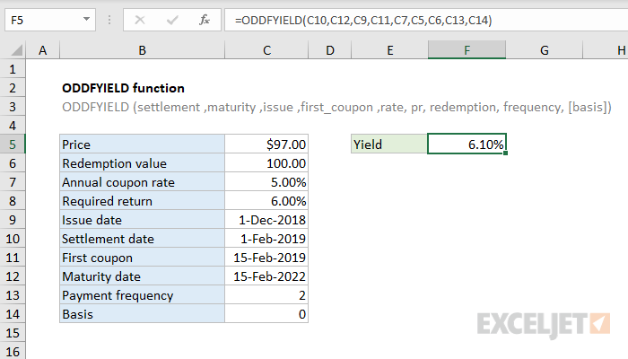

# Excel ODDFYIELD Function




#### Syntax

```text
=ODDFYIELD (sd, md, id, fd, rate, pr, redem, freq, [basis]) 
```

| **Parameter** | **Penjelasan** |
| :--- | :--- |
|  settlement | Settlement tanggal keamanan |
| maturity | Maturity tanggal keamanan |
| issue | Tanggal masalah keamanan |
| first\_coupon | Tanggal kupon pertama keamanan |
| rate | Tingkat bunga sekuritas |
| pr | Harga keamanan |
| redemption | Nilai penebusan keamanan per nilai nominal $ 100 |
| frequency | Jumlah pembayaran kupon per tahun |
| \[basis\] | Argumen integer opsional yang menentukan basis hitungan hari keuangan yang digunakan oleh keamanan |


* Jika tanggal tidak valid \(mis. Bukan tanggal sebenarnya\) ODDFYIELD mengembalikan \#VALUE!
* ODDFYIELD mengembalikan \#NUM saat: 1.\(maturity &gt; first\_coupon &gt; settlement &gt; issue\) NOT true 2.rate &lt;0 atau pr &lt;= 0  3.Basis di luar jangkauan


