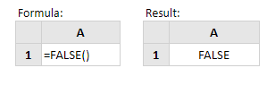

# FALSE

Fungsi Excel **False** mengembalikan nilai logis FALSE.

Fungsi ini tidak membutuhkan argumen dan karenanya, sintaksnya sederhana:

**FALSE\(\)**  
Perhatikan bahwa Anda juga bisa mendapatkan hasil yang sama hanya dengan mengetik teks **'FALSE'** ke dalam spreadsheet Anda.  
  
**Contoh:**

