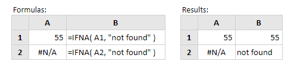

# IFNA

Rumus IFNA yaitu rumus Excel logika yang digunakan untuk mengembalikan nilai yang bisa kita tentukan, jika terjadi kesalahan atau Error \#N/A, jika tidak maka menghasilkan nilai awal atau rumus awal.

Sintak penulisan rumus IFNA

```text
=IFNA(value;value_ifna)
```

_keterangan_

_value : nilai yang diperiksa_  
****_value\_ifna : nilai yang dihasilkan jika kesalahan atau error \#N/A_

contoh penggunaan

=IFNA\(A1;”not found”\)  
jadi ketika cell A1 error NA hasilnya digantikan “not found”  
=IFNA\(A1;””\)  
jadi ketika cell A1 error NA hasilnya digantikan kosong “”

**Contoh:** 



