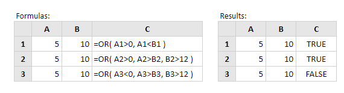

# OR

Fungsi Excel OR menguji sejumlah kondisi yang disediakan dan mengembalikan salah satu:

**TRUE** jika APA SAJA dari kondisi yang dievaluasi menjadi BENAR  
atau  
**FALSE** sebaliknya \(mis. Jika SEMUA kondisi mengevaluasi ke FALSE\).  
  
Sintaks fungsi adalah: 

```text
OR (logical_test1, [logical_test2], ...)
```

di mana argumen logical\_test adalah satu atau lebih kondisi yang mengevaluasi TRUE atau FALSE.

Catatan: Jika argumen logical\_test mengevaluasi ke angka, alih-alih nilai logis, nilai nol diperlakukan sebagai SALAH dan semua nilai bukan nol diperlakukan sebagai BENAR.  
  
**Contoh**



