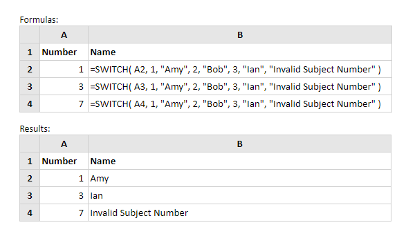

# SWITCH

Fungsi Excel Switch membandingkan sejumlah nilai yang disediakan untuk ekspresi tes yang disediakan dan mengembalikan hasil yang sesuai dengan nilai pertama yang cocok dengan ekspresi tes. Nilai default dapat diberikan, untuk dikembalikan jika tidak ada nilai yang diberikan cocok dengan ekspresi tes.

Sintaks fungsi Switch adalah:

```text
SWITCH (ekspresi, value1, result1, [value2, result2], [value3, result3], ..., [default])
```



