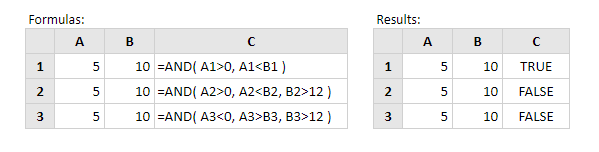

# AND

Fungsi Excel AND menguji sejumlah kondisi dan pengembalian yang disediakan:

* **TRUE** jika SEMUA kondisi mengevaluasi ke BENAR

atau

* **FALSE** sebaliknya \(mis. Jika APA SAJA dari kondisi yang dievaluasi menjadi FALSE\).

Sintaks fungsi adalah: 

```text
AND (logical_test1, [logical_test2], ...)
```

di mana argumen logical\_test adalah satu atau lebih kondisi yang mengevaluasi TRUE atau FALSE.  
  
Catatan. Jika argumen logical\_test mengevaluasi ke angka, alih-alih nilai logis, nilai nol diperlakukan sebagai SALAH dan semua nilai bukan nol diperlakukan sebagai BENAR.  
  
**Contoh :**



