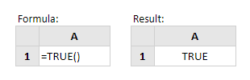

# TRUE

Fungsi Excel True mengembalikan nilai logis TRUE.

Fungsi ini tidak membutuhkan argumen dan karenanya, sintaksnya sederhana:

**TRUE\(\)**  
Perhatikan bahwa Anda juga bisa mendapatkan hasil yang sama hanya dengan mengetik teks **'TRUE'** ke dalam spreadsheet Anda.  
  
**Contoh:**

