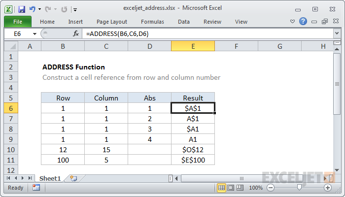

# Excel ADDRESS Function




#### Syntax

```text
=ADDRESS (row_num, col_num, [abs_num], [a1], [sheet])
```

#### Parameter 

| **Parameter** | **Penjelasan** |
| :--- | :--- |
|  row\_num | Nomor baris yang digunakan di alamat sel |
| col\_num | Nomor kolom yang akan digunakan dalam alamat sel |
| abs\_num | \[opsional\] Jenis alamat \(mis. absolut, relatif\). Default ke absolut |
| a1 | \[opsional\] Gaya referensi |
| sheet | \[opsional\] Nama lembar kerja yang akan digunakan. Default ke sheet saat ini |

#### Note


* Use ADDRESS to create an address from a given row and column number.


