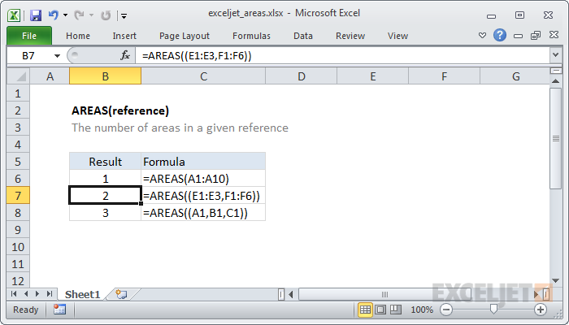

# Excel AREAS Function




#### Syntax

```text
=AREAS (reference)
```

#### Parameter 

| **Parameter** | **Penjelasan** |
| :--- | :--- |
|  reference | Referensi ke sel atau rentang sel |

#### Note


* Referensi dapat mencakup lebih dari satu referensi. Anda harus memisahkan beberapa referensi dengan koma dan kemudian membungkusnya dengan seperangkat tanda kurung tambahan. Jika tidak, Excel akan menganggap koma menunjukkan beberapa argumen dan menghasilkan kesalahan.



