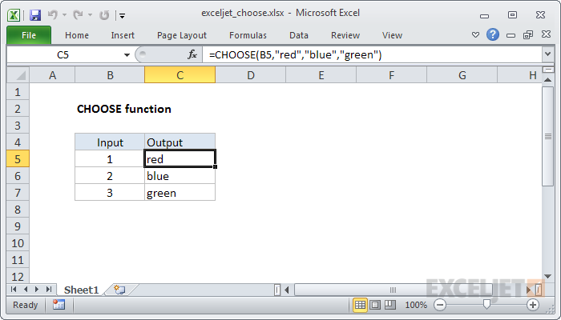

# Excel CHOOSE Function



#### Syntax

```text
=CHOOSE (index_num, value1, [value2], ...)
```

#### Parameter 

| **Parameter** | **Penjelasan** |
| :--- | :--- |
|  index\_num | Nilai untuk dipilih. Angka antara 1 dan 254 |
| value1 | Nilai pertama untuk dipilih |
| value2 | \[opsional\] Nilai kedua untuk dipilih. |

#### Note


* Jika index\_num berada di luar jangkauan, CHOOSE akan mengembalikan \#VALUE



