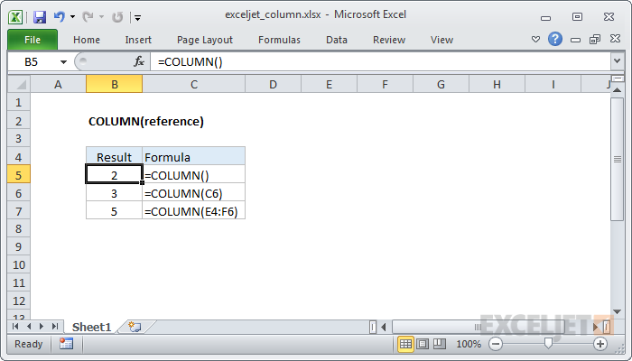

# Excel COLUMN Function




#### Syntax

```text
=COLUMN ([reference])
```

#### Parameter 

| **Parameter** | **Penjelasan** |
| :--- | :--- |
|  reference | \[opsional\] Referensi ke sel atau rentang sel |

#### Note


* Referensi adalah opsional dan akan default ke sel tempat fungsi COLUMN ada.


