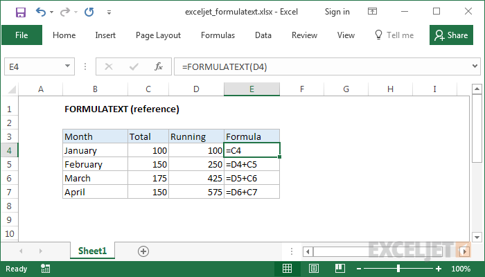

# Excel FORMULATEXT Function




#### Syntax

```text
=FORMULATEXT (reference)
```

#### Parameter 

| **Parameter** | **Penjelasan** |
| :--- | :--- |
|  reference | Referensi ke sel atau rentang sel |

#### Note


* Jika Anda menggunakan FORMULATEXT pada sel yang tidak mengandung rumus, Anda akan mendapatkan kesalahan \# N / A.


