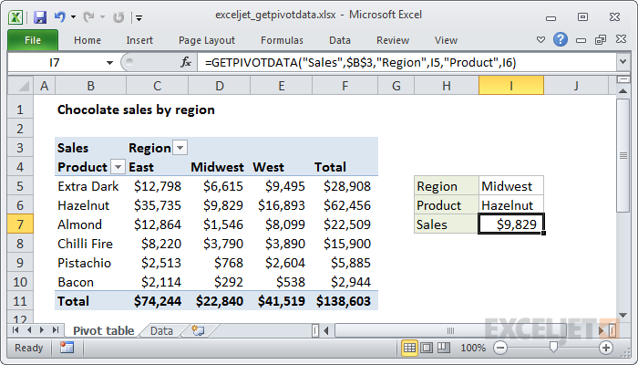

# Excel GETPIVOTDATA Function




#### Syntax

```text
=GETPIVOTDATA (data_field, pivot_table, [field1, item1], ...)
```

#### Parameter 

| **Parameter** | **Penjelasan** |
| :--- | :--- |
|  data\_field | Nama field untuk querry |
| pivot\_table | Referensi ke sel mana pun di tabel pivot untuk querry |
| field1, item1 | \[opsional\] Pasangan field / item |

#### Note


* Gunakan fungsi GETPIVOTDATA untuk querry tabel pivot yang ada dan mengambil data spesifik berdasarkan pada struktur tabel pivot.


