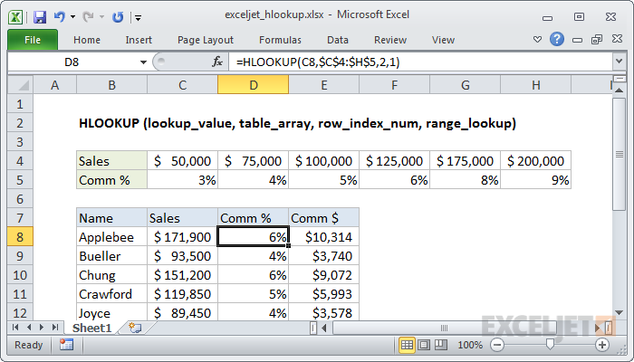

# HLOOKUP

HLOOKUP adalah fungsi Excel untuk mencari dan mengambil data dari baris tertentu dalam tabel. "H" di HLOOKUP adalah singkatan dari "horizontal", di mana nilai pencarian muncul di baris pertama tabel.



#### Syntax

```text
=HLOOKUP (value, table, row_index, [range_lookup])
```

| **Parameter** | **Penjelasan** |
| :--- | :--- |
| value | Nilai yang akan di lookup |
| table | Tabel yang digunakan untuk mengambil data |
| row\_index | Nomor baris yang digunakan untuk mengambil data |
| range\_lookup | opsional\] Boolean untuk mengindikasikan kecocokan yang tepat atau perkiraan kecocokan |


* HLOOKUP mencari nilai di baris pertama tabel. Di kolom  yang cocokan akan  mengambil nilai dari baris yang ditentukan.


