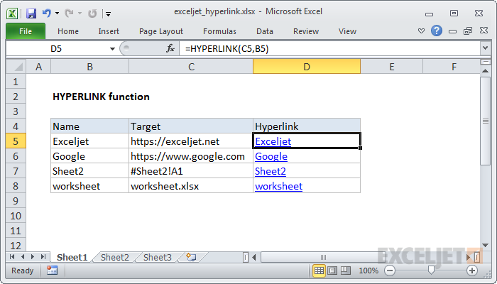

# Excel HYPERLINK Function




#### Syntax

```text
=HYPERLINK (link_location, [friendly_name])
```

#### Parameter 

| **Parameter** | **Penjelasan** |
| :--- | :--- |
|  link\_location | Path ke file atau halaman yang akan dibuka |
| friendly\_name | \[opsional\] Teks tautan untuk ditampilkan dalam sel. |


* Gunakan fungsi HYPERLINK untuk membuat tautan ke lokasi buku kerja, halaman di internet, atau ke file di server jaringan.


