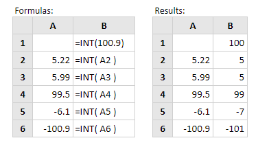

# INT

**INT** digunakan membulatkan bilangan desimal atau menjadi bilangan bulat namun pembulataanya kebawah.  
Sintaks fungsi INT adalah:

```text
INT( number )
```

Berikut cara penggunaannya :




