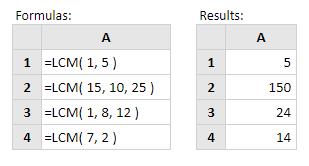

# LCM

Cara mencari nilai KPK \(Kelipatan Persekutuan Terkecil\) menggunakan rumus Excel yaitu menggunakan rumus Excel LCM \(Least Common Multiple\). Carannya sangat mudah yaitu sebagai berikut :

Sintak penulisan rumus LCM

```text
=LCM (number1;number2; dst)
```

_Ket :  
number1  : bilangan1  
number2  : bilangan2_



