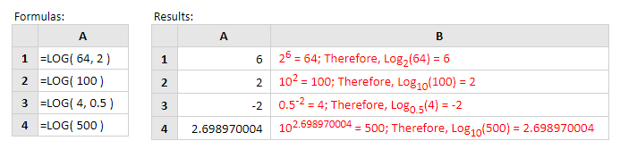

# LOG

Dalam logaritma ada dua  jenis yang bisa dibedakan pada basisnya :

**1. Berbasis 10,** syntak penulisan menggunakan rumus excelnya yaitu

```text
=LOG10 (number)
```

**2. Berbasis n,** Sytak penulisannya

```text
=LOG(number;base)
```

_number : angka  base : basis logaritma_



