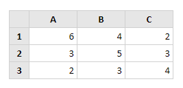

# MDETERM

Fungsi **MDETERM** adalah fungsi untuk mencari determinan dari sebuah matriks. Sintaks fungsi ini adalah

```text
=MDETERM(Array)
```

**Contoh:**



=MDETERM\( A1:C3 \)

**Hasilnya** _40_.

