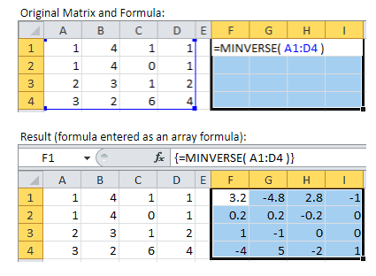

# MINVERSE


Fungsi **MINVERSE** adalah fungsi untuk mencari inverse dari sebuah matriks. Sintaks fungsi ini adalah

```text
=MINVERSE(Array)
```

**Contoh:**



Untuk penggunaan rumus excel ini agak berbeda, caranya  :

1. Kita blok/select untuk kolom hasilnya sesuai jumlah kolom dan baris matrik
2. Kemudian Ketikan **=MINVERSE** 
3. Kemudian select/pilih array matriksnya
4. kemudian tekan tombol **Shift + ctrl + Enter**
5. Maka didapat hasil contoh seperti diatas.

