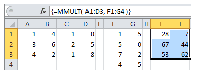

# MMULT


Fungsi **MMULT** adalah fungsi untuk mencari hasil perkalian dari dua buah matriks. Sintaks fungsi ini adalah

```text
=MMULT(Array1;Array2)
```

**Contoh:**




* Pertama select/block baris dan kolom untuk hasilnya **I1:J3**
* Kemudian ketikan rumus **=MMULT**
* Selanjutnya select array1 **A1:E3** dan array2 **F1:G4**
* Selanjutnya tekan tombol pada keyboard **Shift, Ctrl dan Enter**
* rumusnya akan menjadi seperti ini **=MMULT\(A4:B5;D4:E5\)**
* Maka akan didapat hasil yang sama dengan cara manual

