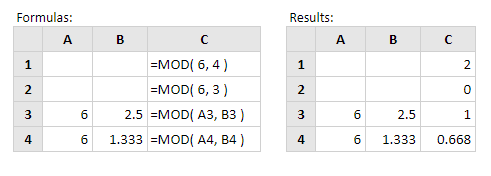

# MOD

Rumus **MOD** excel yaitu digunakan untuk mencari nilai dari sisa hasil bagi suatu bilangan. Kalau bembagian kita mencari hasil baginya sementara untuk rumus MOD ini mencari sisanya dari hasil pembagian tersebut. Sintaksnya:

```text
=MOD(number;divisor)
```

**Contoh:**



