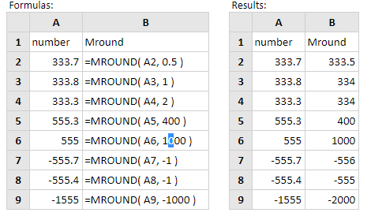

# MROUND

Fungsi Excel MROUND membulatkan angka yang disediakan naik atau turun ke kelipatan terdekat dari nomor yang diberikan. Sintaksnya:

```text
MROUND( number, multiple )
```

| Parameter | Deskripsi |
| :--- | :--- |
| number | Nomor yang akan dibulatkan. |
| multiple | Kelipatan nomor harus dibulatkan |

**Contoh:**



