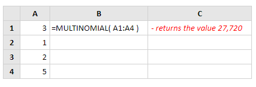

# MULTINOMIAL

Fungsi Multinomial Excel menghitung rasio faktorial dari jumlah nilai yang disediakan untuk hasil faktorial dari nilai-nilai tersebut.

**Contoh:** 


Sintaks dari fungsi MULTINOMIAL adalah:

```text
MULTINOMIAL( number1, [number2], ... )
```

**Catatan**: Jika salah satu dari nilai yang diberikan adalah desimal, maka akan dibulatkan menjadi bilangan bulat.  
**Contoh:**



