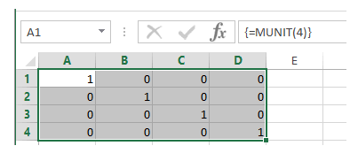

# MUNIT

Fungsi Excel MUNIT mengembalikan unit matriks untuk dimensi yang ditentukan.

Sintaks fungsi adalah:

```text
MUNIT (dimension)
```

di mana argumen dimensi adalah nilai integer yang menentukan dimensi matriks unit. Nilai ini harus lebih besar dari 0.

Catatan: Saat fungsi Excel Munit mengembalikan array nilai, fungsi tersebut harus dimasukkan sebagai Formula Array.

**Memasukkan Rumus Array**

Untuk memasukkan rumus array, Anda harus terlebih dahulu menyorot rentang sel tempat fungsi tersebut dimasukkan. Ketik fungsi ke sel pertama rentang, dan tekan **Ctrl + Shift + Enter.**

**Contoh** Fungsi Munit Spreadsheet di bawah ini menunjukkan fungsi Munit, yang digunakan untuk memasukkan matriks unit 4x4 ke dalam sel A1-D4:

Seperti yang ditampilkan di bilah rumus, rumus untuk ini adalah:

= MUNIT \(4\)



