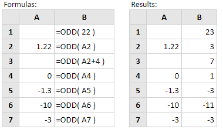

# ODD

Rumus Excel O**DD** adalah rumus Excel yang digunakan untuk membulatkan bilangan menjadi bilangan ganjil terdekat. Jika bilangan positif akan dibulatkan ganjil ke atas, sedangkan bilangan negatif akan dibulatkan ganjil ke bawah.

Jadi setiap bilangan akan di kembalikan menjadi bilangan ganjil terdekat.

Sintak rumusnya :

```text
=ODD(number)
```

**Contoh:**



