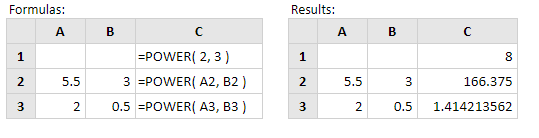

# POWER

Rumus power excel yaitu sama saja dengan pangkat digunakan untuk memangkatkan bilangan. Biasanya kita menggunakan simbol operator ^ untuk menghitung memangkatkan bilangan misalnya : = 2^5 hasilnya 32.Sintaks fungsi ini adalah:

```text
=POWER (number;power)
```

 _ket :_  
_number atau bilangan_   
_power merupakan pangkatnya._

**Contoh:**



