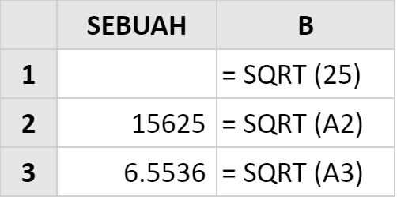
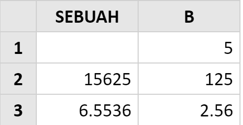

# SQRT

### Syntax



```text
SQRT( number )
```



### Parameter

| Parameter | Deskripsi |
| :--- | :--- |
| Number | Nilai numerik yang ingin Anda temukan akar kuadratnya. |

### **Contoh Implementasi**





