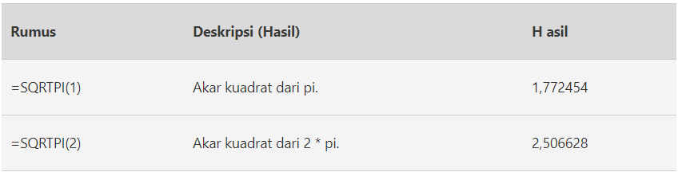

# SQRTPI

### Syntax



```text
SQRTPI ( Number )
```



### Parameter

| Parameter | Deskripsi |
| :--- | :--- |
| Number  | Nilai numerik positif, yang ingin Anda kalikan dengan pi, sebelum menghitung akar kuadrat. |




> #### Jika angka &lt; 0, SQRTPI mengembalikan nilai kesalahan \#NUM!.


###  Implementasi



