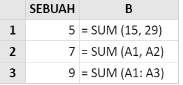
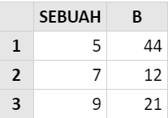

# SUM

### Syntax



```text
SUM( number1, [number2], ... )
```



### Parameter 

| Parameter | Deskripsi |
| :--- | :--- |
| Number | Seperangkat angka \(atau array angka\) yang akan ditentukan jumlahnya. |

### Contoh Implementasi





