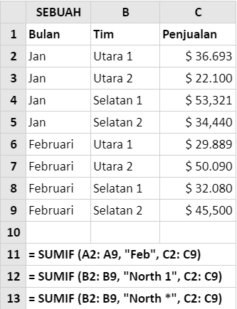
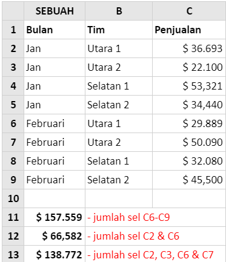
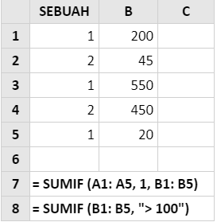
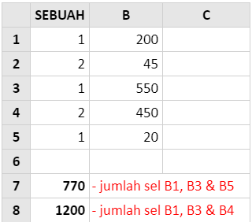

# SUMIF

## Syntax



```text
SUMIF( range, criteria, [sum_range] )
```



## Parameter

| Parameter | Deskripsi |
| :--- | :--- |


| Range \(rentang\) | Array nilai \(atau rentang sel yang mengandung nilai\) untuk diuji terhadap kriteria yang disediakan. |
| :--- | :--- |


| Kriteria | Kondisi yang akan diuji terhadap masing-masing nilai dalam rentang yang disediakan. |
| :--- | :--- |


<table>
  <thead>
    <tr>
      <th style="text-align:left">[sum_range]</th>
      <th style="text-align:left">
        <ul>
          <li>Array opsional nilai numerik (atau sel yang mengandung nilai numerik),
            yang harus ditambahkan bersama, jika entri rentang yang sesuai memenuhi
            kriteria yang disediakan.</li>
          <li>Jika argumen [sum_range] dihilangkan, nilai-nilai dari argumen rentang
            dijumlahkan sebagai gantinya.</li>
        </ul>
      </th>
    </tr>
  </thead>
  <tbody></tbody>
</table>
**Penting:** Kriteria teks atau kriteria apa pun yang mencakup simbol logika atau matematika harus disertakan dalam tanda kutip ganda \(**"**\). Jika kriteria adalah numerik, tanda kutip ganda tidak diperlukan.


## Contoh Implementasi

### contoh 1

Untuk setiap panggilan ke fungsi Excel Sumif, argumen **rentang** \(untuk diuji dengan **kriteria** \) adalah rentang sel A2-A9 atau rentang sel B2-B9, dan argumen **\[sum\_range\]** \(berisi nilai yang akan dijumlahkan\) adalah rentang sel C2-C9.





Perhatikan bahwa, dalam contoh di atas:

* Fungsi dalam sel A13 menggunakan wildcard \* dan menemukan sel dalam rentang B2-B9 yang dimulai dengan string teks "Utara". Ini puas dengan nilai-nilai "Utara 1" dan "Utara 2".
* Dalam ketiga contoh, kriteria berbasis teks \(termasuk wildcard\) terbungkus dalam tanda kutip.

### Contoh 2

Contoh berikut menunjukkan fungsi Excel Sumif menggunakan kriteria berdasarkan nilai numerik.





Perhatikan bahwa, dalam spreadsheet di atas:

* **Kriteria** dalam sel A8 adalah ekspresi, dan karenanya, dilampirkan dalam tanda kutip.
* Argumen **\[sum\_range\]** dihilangkan dari fungsi di sel A8 dan nilai-nilai dalam array range \(yaitu sel B2-B6\) dijumlahkan.

