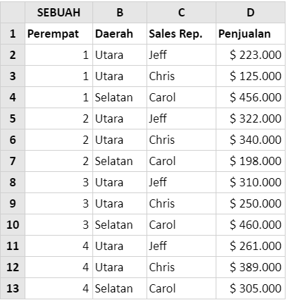

# SUMIFS

### Syntax



```text
SUMIFS ( sum_range , criteria_range1 , criteria1 , [criteria_range2, criteria2] , ...)
```



### Parameter

<table>
  <thead>
    <tr>
      <th style="text-align:left">Parameter</th>
      <th style="text-align:left">Deskripsi</th>
    </tr>
  </thead>
  <tbody>
    <tr>
      <td style="text-align:left">sum_rang</td>
      <td style="text-align:left">Array nilai numerik (atau rentang sel yang mengandung angka) yang akan
        ditambahkan bersama jika kriteria terpenuhi./ rentang sel untuk dijumlahkan</td>
    </tr>
    <tr>
      <td style="text-align:left">Kriteria_range1, kriteria_range2..</td>
      <td style="text-align:left">
        <p>Rentang yang diuji menggunakan <b>Criteria1</b>.</p>
        <p><b>Criteria_range1 </b>dan <b>Criteria1</b> mengatur pasangan pencarian
          saat suatu rentang ditelusuri untuk kriteria tertentu. Setelah item dalam
          rentang ditemukan, nilai item yang berhubungan dalam <b>Sum_range</b> akan
          ditambahkan.</p>
        <p></p>
        <p>(Array criteria_range yang disediakan semua harus memiliki panjang yang
          sama dengan sum_range ).</p>
      </td>
    </tr>
    <tr>
      <td style="text-align:left">kriteria1, kriteria2..</td>
      <td style="text-align:left">Kondisi yang akan diuji terhadap nilai di criteria_range1 , [criteria_range2]
        , ...</td>
    </tr>
  </tbody>
</table>### Contoh Implementasi

Spreadsheet di bawah ini menunjukkan angka penjualan triwulanan untuk 3 perwakilan penjualan.  
Fungsi Sumif dapat digunakan untuk menemukan angka penjualan total untuk kombinasi kuartal, area, dan staf penjualan.  
  
Ini ditunjukkan dalam contoh di bawah ini.




#### contoh 1

Untuk menemukan jumlah penjualan di wilayah Utara selama kuartal 1:**= SUMIFS \(D2: D13, A2: A13, 1, B2: B13, "North"\)**  
yang menghasilkan _**$ 348.000**_ **.**  
  
Dalam contoh ini, fungsi Excel Sumifs mengidentifikasi baris tempat:  
- Nilai dalam kolom A sama dengan 1  
- Entri di kolom B sama dengan "Utara"  
dan menghitung jumlah nilai yang sesuai dari kolom D.  
Yaitu rumus ini menemukan jumlah nilai $ 223.000 dan $ 125.000 \(dari sel D2 dan D3\).

#### contoh 2

Sekali lagi, menggunakan spreadsheet data di atas, kita juga dapat menggunakan fungsi Sumif untuk menemukan total penjualan "Jeff", selama kuartal 3 dan 4:  
= **SUMIFS \(D2: D13, A2: A13, "&gt; 2", C2: C13, "Jeff"\)**  
Formula ini mengembalikan hasilnya ****_**$ 571.000**_ **.**  
  
Dalam contoh ini, fungsi Excel Sumifs mengidentifikasi baris tempat:  


* Nilai dalam kolom A lebih besar dari 2
*  Entri di kolom C sama dengan "Jeff" dan menghitung jumlah nilai yang sesuai di kolom D. Yaitu rumus ini menemukan jumlah nilai $ 310.000 dan $ 261.000 \(dari sel D8 dan D11\). 

  


