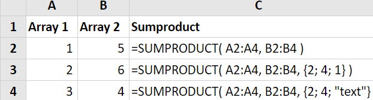
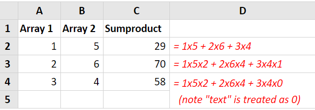

# SUMPRODUCT

## Syntax

```text
SUMPRODUCT( array1, [array2], [array3], ... )
```

## Parameter

| Parameter | Deskripsi |
| :--- | :--- |


| **Array1** | Diperlukan. Argumen array pertama yang komponen-komponennya ingin Anda kalikan lalu tambahkan. |
| :--- | :--- |


| **Array2,array3,...** | Opsional. Argumen array 2 sampai 255 yang komponen-komponennya ingin Anda kalikan lalu tambahkan |
| :--- | :--- |




## Keterangan

* Argumen array harus memiliki dimensi yang sama. Jika tidak, SUMPRODUCT mengembalikan nilai kesalahan \#VALUE!.
* SUMPRODUCT memperlakukan entri array yang bukan numerik seperti angka nol.

## Contoh Implementasi





