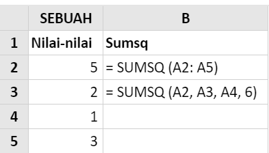
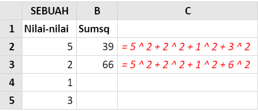

# SUMSQ

### Syntax



```text

SUMSQ( number1, [number2], ... )
```



### Parameter

| Parameter | Deskripsi  |
| :--- | :--- |
| number1, \[number2\] | Number1 diperlukan, nomor selanjutnya adalah opsional. Argumen 1 sampai 255 yang ingin Anda dapatkan jumlah kuadratnya.Anda juga bisa menggunakan array tunggal atau array referensi daripada argumen yang dipisahkan oleh koma |

### Contoh Implementasi





